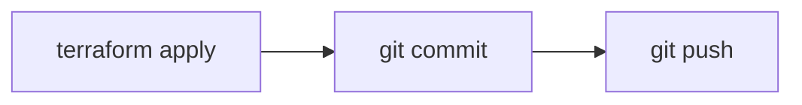
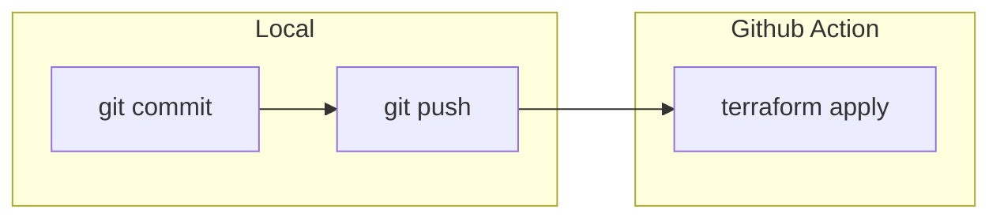
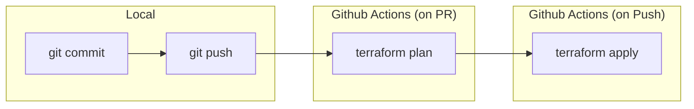
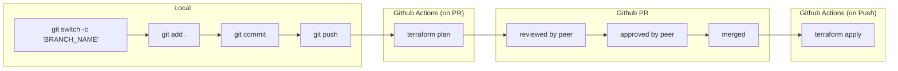

# 작업 흐름

Github로 Terraform 프로젝트를 운영할 때, 어떤 흐름으로 작업을 진행할 수 있는지 알아봅시다.

## 간단하게 접근하기

Github를 활용하는 가장 쉬운 방법은 현재 프로젝트의 내용을 그대로 Github Repository에 올리는 것(push)입니다.
`terraform apply` 명령어 이후 `git push` 명령어를 입력하는 규칙을 가지게 되겠죠.
Repository는 코드의 가장 최신 버전을 담는 저장소 용도로 사용될 것입니다.

이 방법은 매우 간단하기는 하지만 다음과 같은 문제들이 있습니다.

1. `terraform apply` 이후 작업자가 깜빡하여 `git push` 를 하지 않는 경우, Repository는 가장 최신 버전을 담는 저장소가 아니게 됩니다. 이렇게 실수할 일이 얼마나 있겠냐만은, 사람이 수동으로 하나씩 해줘야 하는 일이기 때문에 분명히 일어날 가능성이 있습니다.

2. 만약 Terraform 프로젝트를 다루는 작업자가 두 명 이상일 경우, 위 경우의 여파로 최신 버전이 아닌 Repository를 받아와(clone 또는 pull) `terraform apply` 명령어를 입력하게 될 것입니다. 이 때 프로비저닝된 리소스는 꼬이게 될 것입니다.

만약 Terraform 프로젝트르 다루는 작업자가 본인 혼자 뿐이라면, 1번 문제를 잘 인지하고 컨트롤 할 수 있을지 모릅니다. 그러나 혼자가 아니라면 2번 문제가 매우 심각한 이슈가 되고, 이렇게 단순하게 Github를 사용할 수 없게 됩니다.

## CD 워크플로우를 활용하기

좀 더 생각해볼 수 있는 방법은 `terraform apply` 를 사람이 직접 수행하지 않고, 자동화 워크플로우 도구로 실행하는 것입니다. Github Action을 이용하면 `git push` 가 파이프라인의 트리거가 되고, 파이프라인에서 `terraform apply` 를 수행할 것입니다.

이 방법은 `git push` 와 `terraform apply` 를 항상 같이 동작하도록 만들기 때문에 위에서의 1번 문제를 어느정도 해결할 수 있게 됩니다. 또한 Repository도 항상 최신 코드와 리소스 상태를 표현하게 됩니다.

그러나 이 방법의 또 다른 문제점은 `terraform plan` 이나 `terraform apply` 를 사용자가 직접 실행해볼 수 없기 때문에, 코드의 변경이 어떤 리소스의 변화를 만드는지 명시적으로 알기 어렵습니다. 클라우드 리소스 변경은 모두 비용과 직접적으로 이어지는 것이라 매우 예민한 부분입니다. 이러한 예민한 변경이 명시적으로 드러나지 않는다면, 예기치 못한 문제를 발생시킬 수도 있습니다.

물론 Terraform CLI가 사용하는 ServiceAccount 권한을 적절히 설정하거나 분리하면 사용자가 직접 미리 실행해보아 어떤 변경을 만들어내는지 미리 확인할 수도 있습니다. 하지만 ServiceAcccount에 예외를 두거나 별도의 규칙을 만드는 작업들은 추후에 운영 복잡도를 더 높일 수 있습니다.

## CI 워크플로우를 활용하기

변경사항이 최종적으로 반영되기 전에 프로젝트 작업자들에게 명시적으로 이를 공유하고, 리뷰를 거쳐 최종 변경을 승인하는 작업, 이 기능을 Github에서는 PR(Pull Request)이라는 기능을 통해 가능합니다.

PR을 통해 리소스 변경 사항을 팀원들에게 공유하고, PR 생성 및 그 안의 Commit이 트리거가 되는 파이프라인을 만들어, 그 안에서 코드 검증, 리소스 변경 추적을 사전에 명시적으로 드러나게할 수 있습니다. 특히 명시적인 텍스트나 이미지를 해당 PR의 코멘트로 자동으로 추가되도록 할 수 있습니다.

이전보다 조금 더 복잡해지긴 했지만, 위에서 생각한 문제점들을 자연스레 해결할 수 있게되었습니다.

## 정리

이제 전체적인 작업흐름을 구체적으로 정리해봅시다.

1. 작업자는 본인의 로컬에서 새로운 브랜치를 만든 뒤 작업합니다.
2. 작업자는 작업을 마치고 Github Repsotiory에 Push하고 `main` 브랜치로 PR을 생성합니다.
3. 이 때 Github Action으로 코드를 검증하고 리소스 변경을 확인하는 파이프라인이 실행되고 이 결과를 PR 코멘트로 남깁니다.
4. 리뷰어가 있다면, 변경 사항을 확인하고 Approve 합니다.
5. 작업자는 `main` 브랜치로 해당 PR을 Merge 합니다.
6. 이 때 Github Action으로 `terraform apply` 를 입력하는 파이프라인이 실행됩니다.

앞으로 사용자가 Terraform CLI를 본인의 로컬 환경에서 직접 실행할 일은 없습니다.
로컬에서는 pre-commit으로 코드 검증을 마치고, PR에 Push 됨으로써 오직 Github Action 파이프라인만 Terraform CLI를 실행하게 됩니다.

이제 구체적으로 PR과 Push (`main` 브랜치) 트리거 시 실행되는 Github Action 파이프라인을 직접 구현해봅시다.
