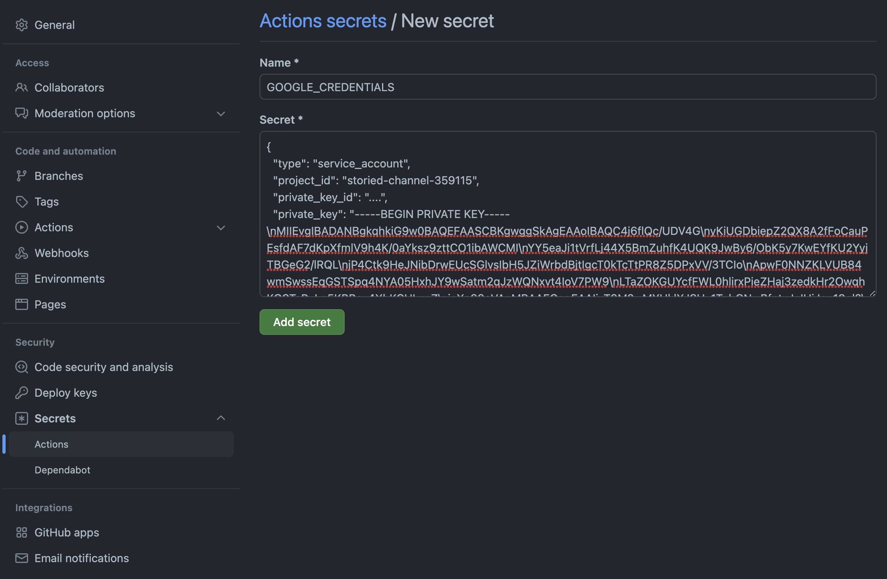
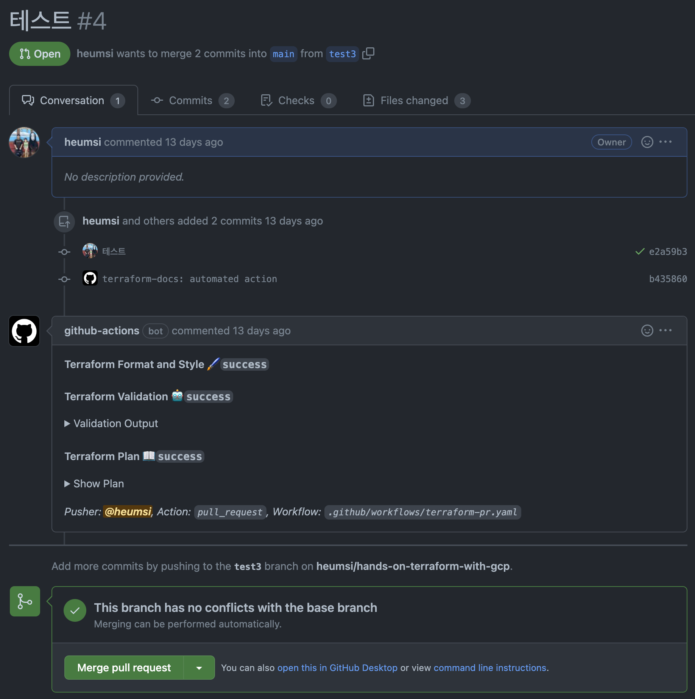

# Pre-commit 액션

이전에 pre-commit으로 commit 시 다음 항목들을 진행하도록 했었습니다.

- Terraform Validate (`terraform validate`)
- Terraform Formatting (`terraform fmt`)
- Terraform Lint (`tflint`)
- Terraform Docs (`terraform_docs`)

위 작업은 pre-commit을 쓰면 자동으로 진행되는 것들이지만, 혹여나 작업자가 실수로 pre-commit을 쓰지 않았다면, 위 사항이 진행되지 않고도 commit이 됩니다.
따라서 위 작업들을 "강제로" 진행되게 하려면, PR 시에 위 사항들이 자동으로 진행되도록 해야합니다.

또한 Github 기반으로 Terraform 명령을 수행하면, PR에서 Merge되기 전 `terraform plan` 의 결과를 볼 수 있어야 합니다. 구체적으로 무엇이 변하는지 PR에서 볼 수 있어야겠죠.

이제 위 사항들이 진행되도록 Github Action을 활용해봅시다.

## yaml 작성하기

`.github/workflows/terraform-pr.yaml` 를 다음처럼 작성합니다.

```yaml title=".github/workflows/terraform-pr.yaml"
on:
  pull_request:
    branches:
      - main

jobs:
  terraform-pr:
    runs-on: ubuntu-latest
    defaults:
      run:
        working-directory: ./practice
    steps:
    - name: Checkout
      uses: actions/checkout@v3
      with:
        ref: ${{ github.event.pull_request.head.ref }}
      
    - name: Setup Terraform
      uses: hashicorp/setup-terraform@v2
      with:
        terraform_version: 1.2.8

    - name: Terraform Init
      id: init
      run: terraform init
      env:
        GOOGLE_CREDENTIALS: ${{ secrets.GOOGLE_CREDENTIALS }}

    - name: Terraform Validate
      id: validate
      run: terraform validate
      env:
        GOOGLE_CREDENTIALS: ${{ secrets.GOOGLE_CREDENTIALS }}

    - name: Terraform Format
      id: fmt
      run: terraform fmt -check
      continue-on-error: true
      env:
        GOOGLE_CREDENTIALS: ${{ secrets.GOOGLE_CREDENTIALS }}

    - name: Render terraform docs and push changes back to PR
      uses: terraform-docs/gh-actions@main
      with:
        working-dir: ./practice
        output-file: README.md
        output-method: inject
        git-push: "true"
        recursive: "true"

    - name: Terraform Plan
      id: plan
      run: terraform plan -no-color
      continue-on-error: true
      env:
        GOOGLE_CREDENTIALS: ${{ secrets.GOOGLE_CREDENTIALS }}

    - uses: actions/github-script@v6
      if: github.event_name == 'pull_request'
      env:
        PLAN: "terraform\n${{ steps.plan.outputs.stdout }}"
        GOOGLE_CREDENTIALS: ${{ secrets.GOOGLE_CREDENTIALS }}
      with:
        github-token: ${{ secrets.GITHUB_TOKEN }}
        script: |
          const output = `#### Terraform Format and Style 🖌\`${{ steps.fmt.outcome }}\`
          #### Terraform Validation 🤖\`${{ steps.validate.outcome }}\`
          <details><summary>Validation Output</summary>

          \`\`\`\n
          ${{ steps.validate.outputs.stdout }}
          \`\`\`

          </details>

          #### Terraform Plan 📖\`${{ steps.plan.outcome }}\`
          
          <details><summary>Show Plan</summary>
          
          \`\`\`tf\n
          ${process.env.PLAN}
          \`\`\`
          
          </details>
          
          *Pusher: @${{ github.actor }}, Action: \`${{ github.event_name }}\`, Workflow: \`${{ github.workflow }}\`*`;
            
          github.rest.issues.createComment({
            issue_number: context.issue.number,
            owner: context.repo.owner,
            repo: context.repo.repo,
            body: output
          })
```

조금 더 설명을 붙이자면

- `main` 브랜치로 향하는 PR에 대해서만 Action을 실행합니다.
- 저는 Terraform 프로젝트가 Repository 최상단에서 `practice` 라는 디렉토리 내에 있어서 `working-directory` 를 이 디렉토리로 주었습니다. 아마 대부분의 일반적인 경우, 이렇게 디렉토리내 내에 Terraform 프로젝트가 있지 않기 때문에, 이 값은 여기서는 무시하셔도 좋습니다.
- `terraform-docs` 의 경우 pre-commit에서와 조금 다른데, pre-commit에서는 `README.md` 를 업데이트 해주기만 했다면, 여기서는 업데이트된 `README.md` 를 해당 PR에 커밋까지 해줍니다.
- 가장 마지막 step은 이전 step들의 결과를 PR 코멘트로 작성하는 작업입니다.


## Secret 추가하기

위 yaml을 보면 `${{ secrets.GOOGLE_CREDENTIALS }}` 와 같이 Github Repository의 Secret을 사용하는 부분이 보입니다.
아직 Secret을 작성해주지 않았습니다. 이제 웹 Github Repository Web UI로 들어가 다음처럼 `GOOGLE_CREDENTIALS` Secret을 작성해줍시다.



## 결과 확인하기

이제 작성한 Github Action이 잘 작동하는지 확인해봅시다.

먼저 위 변경사항을 다음처럼 커밋하고 푸시합니다.

```bash
$ git add .github/
$ git commit -m "Add github action on pr"
$ git push origin main
```

이제 새 브랜치를 만들고, `google_compute_instance` 를 하나 더 추가해봅시다.

```bash
$ git switch -c "test"
```

```tf title="modules/compute/main.tf"
...

resource "google_compute_instance" "hotwg_asne3_prod_2" {
  name         = "hotwg-asne3-prod-2"
  machine_type = "e2-medium"
  zone         = "asia-northeast3-c"

  boot_disk {
    initialize_params {
      image = "debian-cloud/debian-11"
    }
  }

  network_interface {
    subnetwork = var.subnetwork.id
    # access_config {
    #   nat_ip = var.nat_ip.address
    # }
  }

  service_account {
    email  = var.service_account.email
    scopes = ["cloud-platform"]
  }

  tags = ["allow-http", "allow-ssh"]

  metadata = {
    ssh-keys = "default:ssh-rsa AAAAB3NzaC1yc2EAAAADAQABAAABgQCwdCxPcVEslNkuIA508cd8xRucUIIdKy8PNdHzoFLOzt1HXUtDD6y/pVmqEut4P6DMPPt7WNI8JkqBL7a9FlFIHmLK5hR7aHVKJt7bL/bHacdIH3MagjfwRBmHGY2kTEP+/WSVW6bhqyI5P5dFy22RZt7POqvvzCYnp5rzzl8JBDOjjtLmQz1XwK0Hoa5ue3W1GX8N+TxUo5/psNM4WhHHPZRkRr/lSZqhO4QfwjGK3K88YVyR0kZWWCDsEW/zRZrJgU9/q8oU161Fu/vTZBDw9FoYRfCQ1FfjAw1Wpp1ftXI3hkAyGFf9Ezvfuv5teVO0JnAs5HQ7h8BFw92J45AUSAXcG/yoezqMj/vW3FP08geQhLCZaohc70A5PNkBv90ByACebsOaQ6dbrcdzlZr2KMe2noT9zyr0KMcDmrB7wyUf8jqdRJE7HY4epK+VNwqeZnpvj3n+fHURD2k+Bs8Cpoa6FYfXYW1iRCb+Xe7V7eqHBHTvtGz9o2SfY2a/cC8= user@AL02261967.local"
  }
}
```

??? "전체 코드 보기"

    ```tf title="modules/compute/main.tf"
    resource "google_compute_instance" "hotwg_asne3_prod_1" {
      name         = "hotwg-asne3-prod-1"
      machine_type = "e2-medium"
      zone         = "asia-northeast3-c"

      boot_disk {
        initialize_params {
          image = "debian-cloud/debian-11"
        }
      }

      network_interface {
        subnetwork = var.subnetwork.id
        access_config {
          nat_ip = var.nat_ip.address
        }
      }

      service_account {
        email  = var.service_account.email
        scopes = ["cloud-platform"]
      }

      tags = ["allow-http", "allow-ssh"]

      metadata = {
        ssh-keys = "default:ssh-rsa AAAAB3NzaC1yc2EAAAADAQABAAABgQCwdCxPcVEslNkuIA508cd8xRucUIIdKy8PNdHzoFLOzt1HXUtDD6y/pVmqEut4P6DMPPt7WNI8JkqBL7a9FlFIHmLK5hR7aHVKJt7bL/bHacdIH3MagjfwRBmHGY2kTEP+/WSVW6bhqyI5P5dFy22RZt7POqvvzCYnp5rzzl8JBDOjjtLmQz1XwK0Hoa5ue3W1GX8N+TxUo5/psNM4WhHHPZRkRr/lSZqhO4QfwjGK3K88YVyR0kZWWCDsEW/zRZrJgU9/q8oU161Fu/vTZBDw9FoYRfCQ1FfjAw1Wpp1ftXI3hkAyGFf9Ezvfuv5teVO0JnAs5HQ7h8BFw92J45AUSAXcG/yoezqMj/vW3FP08geQhLCZaohc70A5PNkBv90ByACebsOaQ6dbrcdzlZr2KMe2noT9zyr0KMcDmrB7wyUf8jqdRJE7HY4epK+VNwqeZnpvj3n+fHURD2k+Bs8Cpoa6FYfXYW1iRCb+Xe7V7eqHBHTvtGz9o2SfY2a/cC8= user@AL02261967.local"
      }
    }

    resource "google_compute_instance" "hotwg_asne3_prod_2" {
      name         = "hotwg-asne3-prod-2"
      machine_type = "e2-medium"
      zone         = "asia-northeast3-c"

      boot_disk {
        initialize_params {
          image = "debian-cloud/debian-11"
        }
      }

      network_interface {
        subnetwork = var.subnetwork.id
        # access_config {
        #   nat_ip = var.nat_ip.address
        # }
      }

      service_account {
        email  = var.service_account.email
        scopes = ["cloud-platform"]
      }

      tags = ["allow-http", "allow-ssh"]

      metadata = {
        ssh-keys = "default:ssh-rsa AAAAB3NzaC1yc2EAAAADAQABAAABgQCwdCxPcVEslNkuIA508cd8xRucUIIdKy8PNdHzoFLOzt1HXUtDD6y/pVmqEut4P6DMPPt7WNI8JkqBL7a9FlFIHmLK5hR7aHVKJt7bL/bHacdIH3MagjfwRBmHGY2kTEP+/WSVW6bhqyI5P5dFy22RZt7POqvvzCYnp5rzzl8JBDOjjtLmQz1XwK0Hoa5ue3W1GX8N+TxUo5/psNM4WhHHPZRkRr/lSZqhO4QfwjGK3K88YVyR0kZWWCDsEW/zRZrJgU9/q8oU161Fu/vTZBDw9FoYRfCQ1FfjAw1Wpp1ftXI3hkAyGFf9Ezvfuv5teVO0JnAs5HQ7h8BFw92J45AUSAXcG/yoezqMj/vW3FP08geQhLCZaohc70A5PNkBv90ByACebsOaQ6dbrcdzlZr2KMe2noT9zyr0KMcDmrB7wyUf8jqdRJE7HY4epK+VNwqeZnpvj3n+fHURD2k+Bs8Cpoa6FYfXYW1iRCb+Xe7V7eqHBHTvtGz9o2SfY2a/cC8= user@AL02261967.local"
      }
    }
    ```

이제 변경사항을 커밋하고, 새 브랜치로 푸시합니다.

```bash
$ git commit -m "Add new google_compute_instance"
$ git push origin test
```

그리고 `main` 브랜치로 PR을 생성하면 다음처럼 Github Action의 결과가 잘 나온 것을 확인할 수 있습니다.


