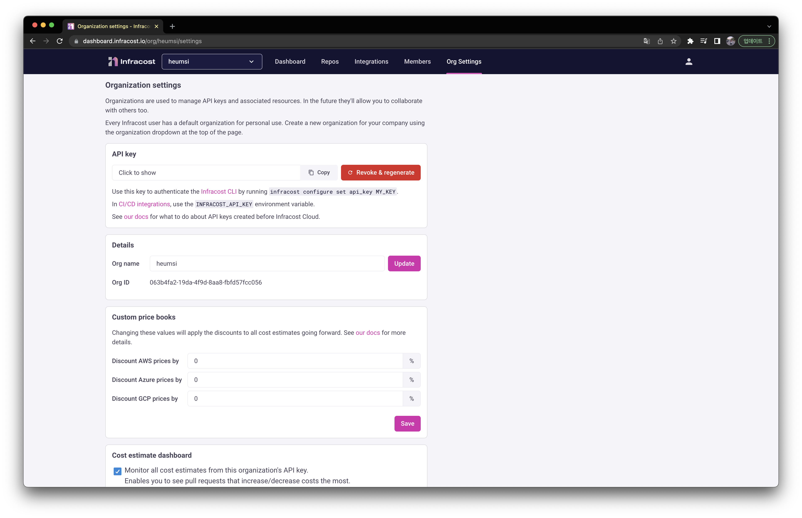
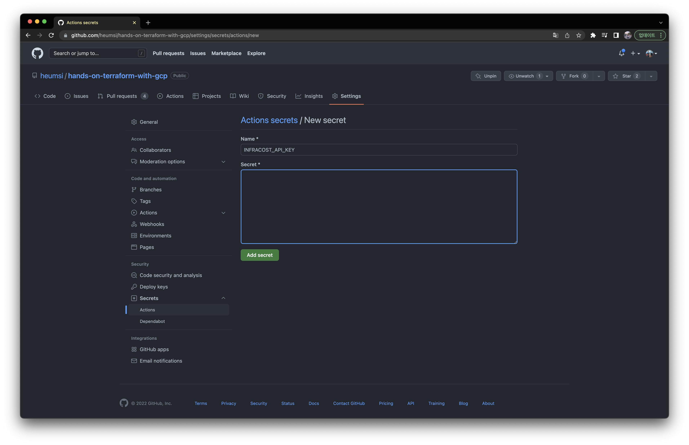
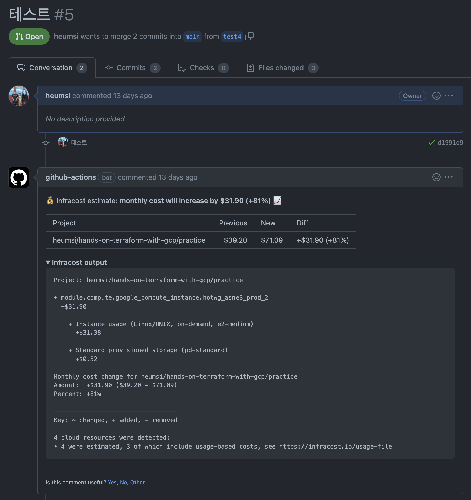

# 추가 예상 비용 확인하기

Terraform 프로젝트에 리소스가 추가되거나 삭제되는 일은 클라우드 비용의 변화를 발생시킵니다.
이는 실제로 꽤 예민한 작업일 수 있습니다.
따라서 우리는 어떤 리소스가 추가되거나 삭제될 때, 이 작업이 어느정도의 클라우드 비용 변화를 발생시키는지 확인할 필요가 있습니다.

이번에는 [Infracost](https://www.infracost.io/)를 통해 PR에서 클라우드 비용이 어떻게 변화하는지 명시적으로 이를 표현해주는 Github Action을 작성해봅시다.

## Infracost 계정 만들기

[Infracost](https://www.infracost.io/)에 접속하여 Sign Up을 통해 계정을 생성합니다.

## yaml 작성하기

`.github/workflows/terraform-pr.yaml` 에 다음을 추가합니다.

```yaml title=".github/workflows/terraform-pr.yaml"
jobs:
  ...

  infracost:
  runs-on: ubuntu-latest
  permissions:
    contents: read
    pull-requests: write

  env:
    TF_ROOT: ./practice
    # This instructs the CLI to send cost estimates to Infracost Cloud. Our SaaS product
    #   complements the open source CLI by giving teams advanced visibility and controls.
    #   The cost estimates are transmitted in JSON format and do not contain any cloud
    #   credentials or secrets (see https://infracost.io/docs/faq/ for more information).
    INFRACOST_ENABLE_CLOUD: true
    # If you're using Terraform Cloud/Enterprise and have variables or private modules stored
    # on there, specify the following to automatically retrieve the variables:
    #   INFRACOST_TERRAFORM_CLOUD_TOKEN: ${{ secrets.TFC_TOKEN }}
    #   INFRACOST_TERRAFORM_CLOUD_HOST: app.terraform.io # Change this if you're using Terraform Enterprise

  steps:
    # If you use private modules, add an environment variable or secret
    # called GIT_SSH_KEY with your private key, so Infracost can access
    # private repositories (similar to how Terraform/Terragrunt does).
    # - name: add GIT_SSH_KEY
    #   run: |
    #     ssh-agent -a $SSH_AUTH_SOCK
    #     mkdir -p ~/.ssh
    #     echo "${{ secrets.GIT_SSH_KEY }}" | tr -d '\r' | ssh-add -
    #     ssh-keyscan github.com >> ~/.ssh/known_hosts

    - name: Setup Infracost
      uses: infracost/actions/setup@v2
      # See https://github.com/infracost/actions/tree/master/setup for other inputs
      # If you can't use this action, see Docker images in https://infracost.io/cicd
      with:
        api-key: ${{ secrets.INFRACOST_API_KEY }}

    # Checkout the base branch of the pull request (e.g. main/master).
    - name: Checkout base branch
      uses: actions/checkout@v2
      with:
        ref: '${{ github.event.pull_request.base.ref }}'

    # Generate Infracost JSON file as the baseline.
    - name: Generate Infracost cost estimate baseline
      run: |
        infracost breakdown --path=${TF_ROOT} \
                            --format=json \
                            --out-file=/tmp/infracost-base.json

    # Checkout the current PR branch so we can create a diff.
    - name: Checkout PR branch
      uses: actions/checkout@v2

    # Generate an Infracost diff and save it to a JSON file.
    - name: Generate Infracost diff
      run: |
        infracost diff --path=${TF_ROOT} \
                        --format=json \
                        --compare-to=/tmp/infracost-base.json \
                        --out-file=/tmp/infracost.json

    # Posts a comment to the PR using the 'update' behavior.
    # This creates a single comment and updates it. The "quietest" option.
    # The other valid behaviors are:
    #   delete-and-new - Delete previous comments and create a new one.
    #   hide-and-new - Minimize previous comments and create a new one.
    #   new - Create a new cost estimate comment on every push.
    # See https://www.infracost.io/docs/features/cli_commands/#comment-on-pull-requests for other options.
    - name: Post Infracost comment
      run: |
          infracost comment github --path=/tmp/infracost.json \
                                    --repo=$GITHUB_REPOSITORY \
                                    --github-token=${{github.token}} \
                                    --pull-request=${{github.event.pull_request.number}} \
                                    --behavior=hide-and-new
```

??? "전체 코드 보기"

    ```yaml title=".github/workflows/terraform-pr.yaml"
    on:
      pull_request:
        branches:
          - main

    jobs:
      terraform-pr:
        runs-on: ubuntu-latest
        defaults:
          run:
            working-directory: ./practice
        steps:
        - name: Checkout
          uses: actions/checkout@v3
          with:
            ref: ${{ github.event.pull_request.head.ref }}
          
        - name: Setup Terraform
          uses: hashicorp/setup-terraform@v2
          with:
            terraform_version: 1.2.8

        - name: Terraform Init
          id: init
          run: terraform init
          env:
            GOOGLE_CREDENTIALS: ${{ secrets.GOOGLE_CREDENTIALS }}

        - name: Terraform Validate
          id: validate
          run: terraform validate
          env:
            GOOGLE_CREDENTIALS: ${{ secrets.GOOGLE_CREDENTIALS }}

        - name: Terraform Format
          id: fmt
          run: terraform fmt -check
          continue-on-error: true
          env:
            GOOGLE_CREDENTIALS: ${{ secrets.GOOGLE_CREDENTIALS }}

        - name: Render terraform docs and push changes back to PR
          uses: terraform-docs/gh-actions@main
          with:
            working-dir: ./practice
            output-file: README.md
            output-method: inject
            git-push: "true"
            recursive: "true"

        - name: Terraform Plan
          id: plan
          run: terraform plan -no-color
          continue-on-error: true
          env:
            GOOGLE_CREDENTIALS: ${{ secrets.GOOGLE_CREDENTIALS }}
        
        - uses: actions/github-script@v6
          if: github.event_name == 'pull_request'
          env:
            PLAN: "terraform\n${{ steps.plan.outputs.stdout }}"
            GOOGLE_CREDENTIALS: ${{ secrets.GOOGLE_CREDENTIALS }}
          with:
            github-token: ${{ secrets.GITHUB_TOKEN }}
            script: |
              const output = `#### Terraform Format and Style 🖌\`${{ steps.fmt.outcome }}\`
              #### Terraform Validation 🤖\`${{ steps.validate.outcome }}\`
              <details><summary>Validation Output</summary>

              \`\`\`\n
              ${{ steps.validate.outputs.stdout }}
              \`\`\`

              </details>

              #### Terraform Plan 📖\`${{ steps.plan.outcome }}\`
              
              <details><summary>Show Plan</summary>
              
              \`\`\`tf\n
              ${process.env.PLAN}
              \`\`\`
              
              </details>
              
              *Pusher: @${{ github.actor }}, Action: \`${{ github.event_name }}\`, Workflow: \`${{ github.workflow }}\`*`;
                
              github.rest.issues.createComment({
                issue_number: context.issue.number,
                owner: context.repo.owner,
                repo: context.repo.repo,
                body: output
              })
      infracost:
        runs-on: ubuntu-latest
        permissions:
          contents: read
          pull-requests: write

        env:
          TF_ROOT: ./practice
          # This instructs the CLI to send cost estimates to Infracost Cloud. Our SaaS product
          #   complements the open source CLI by giving teams advanced visibility and controls.
          #   The cost estimates are transmitted in JSON format and do not contain any cloud
          #   credentials or secrets (see https://infracost.io/docs/faq/ for more information).
          INFRACOST_ENABLE_CLOUD: true
          # If you're using Terraform Cloud/Enterprise and have variables or private modules stored
          # on there, specify the following to automatically retrieve the variables:
          #   INFRACOST_TERRAFORM_CLOUD_TOKEN: ${{ secrets.TFC_TOKEN }}
          #   INFRACOST_TERRAFORM_CLOUD_HOST: app.terraform.io # Change this if you're using Terraform Enterprise

        steps:
          # If you use private modules, add an environment variable or secret
          # called GIT_SSH_KEY with your private key, so Infracost can access
          # private repositories (similar to how Terraform/Terragrunt does).
          # - name: add GIT_SSH_KEY
          #   run: |
          #     ssh-agent -a $SSH_AUTH_SOCK
          #     mkdir -p ~/.ssh
          #     echo "${{ secrets.GIT_SSH_KEY }}" | tr -d '\r' | ssh-add -
          #     ssh-keyscan github.com >> ~/.ssh/known_hosts

          - name: Setup Infracost
            uses: infracost/actions/setup@v2
            # See https://github.com/infracost/actions/tree/master/setup for other inputs
            # If you can't use this action, see Docker images in https://infracost.io/cicd
            with:
              api-key: ${{ secrets.INFRACOST_API_KEY }}

          # Checkout the base branch of the pull request (e.g. main/master).
          - name: Checkout base branch
            uses: actions/checkout@v2
            with:
              ref: '${{ github.event.pull_request.base.ref }}'

          # Generate Infracost JSON file as the baseline.
          - name: Generate Infracost cost estimate baseline
            run: |
              infracost breakdown --path=${TF_ROOT} \
                                  --format=json \
                                  --out-file=/tmp/infracost-base.json

          # Checkout the current PR branch so we can create a diff.
          - name: Checkout PR branch
            uses: actions/checkout@v2

          # Generate an Infracost diff and save it to a JSON file.
          - name: Generate Infracost diff
            run: |
              infracost diff --path=${TF_ROOT} \
                              --format=json \
                              --compare-to=/tmp/infracost-base.json \
                              --out-file=/tmp/infracost.json

          # Posts a comment to the PR using the 'update' behavior.
          # This creates a single comment and updates it. The "quietest" option.
          # The other valid behaviors are:
          #   delete-and-new - Delete previous comments and create a new one.
          #   hide-and-new - Minimize previous comments and create a new one.
          #   new - Create a new cost estimate comment on every push.
          # See https://www.infracost.io/docs/features/cli_commands/#comment-on-pull-requests for other options.
          - name: Post Infracost comment
            run: |
                infracost comment github --path=/tmp/infracost.json \
                                        --repo=$GITHUB_REPOSITORY \
                                        --github-token=${{github.token}} \
                                        --pull-request=${{github.event.pull_request.number}} \
                                        --behavior=hide-and-new
    ```

## Secret 추가하기

위 yaml을 보면 `${{ secrets.INFRACOST_API_KEY }}` 와 같이 Github Repository의 Secret을 사용하는 부분이 보입니다.
`INFRACOST_API_KEY` 는 다음처럼 Infracost 웹 대시보드에서 확인하실 수 있습니다.



웹 Github Repository Web UI로 들어가 다음처럼 `INFRACOST_API_KEY` Secret을 작성해줍시다.



## 결과 확인하기

이제 작성한 Github Action이 잘 작동하는지 확인해봅시다.

먼저 위 변경사항을 다음처럼 커밋하고 푸시합니다.

```bash
$ git add .github/
$ git commit -m "Add infracost job in github action on pr"
$ git push origin main
```

이제 새 브랜치를 만들고, `google_compute_instance` 를 하나 더 추가해봅시다.

```bash
$ git switch -c "test2"
```

```tf title="modules/compute/main.tf"
...

resource "google_compute_instance" "hotwg_asne3_prod_2" {
  name         = "hotwg-asne3-prod-2"
  machine_type = "e2-medium"
  zone         = "asia-northeast3-c"

  boot_disk {
    initialize_params {
      image = "debian-cloud/debian-11"
    }
  }

  network_interface {
    subnetwork = var.subnetwork.id
    # access_config {
    #   nat_ip = var.nat_ip.address
    # }
  }

  service_account {
    email  = var.service_account.email
    scopes = ["cloud-platform"]
  }

  tags = ["allow-http", "allow-ssh"]

  metadata = {
    ssh-keys = "default:ssh-rsa AAAAB3NzaC1yc2EAAAADAQABAAABgQCwdCxPcVEslNkuIA508cd8xRucUIIdKy8PNdHzoFLOzt1HXUtDD6y/pVmqEut4P6DMPPt7WNI8JkqBL7a9FlFIHmLK5hR7aHVKJt7bL/bHacdIH3MagjfwRBmHGY2kTEP+/WSVW6bhqyI5P5dFy22RZt7POqvvzCYnp5rzzl8JBDOjjtLmQz1XwK0Hoa5ue3W1GX8N+TxUo5/psNM4WhHHPZRkRr/lSZqhO4QfwjGK3K88YVyR0kZWWCDsEW/zRZrJgU9/q8oU161Fu/vTZBDw9FoYRfCQ1FfjAw1Wpp1ftXI3hkAyGFf9Ezvfuv5teVO0JnAs5HQ7h8BFw92J45AUSAXcG/yoezqMj/vW3FP08geQhLCZaohc70A5PNkBv90ByACebsOaQ6dbrcdzlZr2KMe2noT9zyr0KMcDmrB7wyUf8jqdRJE7HY4epK+VNwqeZnpvj3n+fHURD2k+Bs8Cpoa6FYfXYW1iRCb+Xe7V7eqHBHTvtGz9o2SfY2a/cC8= user@AL02261967.local"
  }
}
```

??? "전체 코드 보기"

    ```tf title="modules/compute/main.tf"
    resource "google_compute_instance" "hotwg_asne3_prod_1" {
      name         = "hotwg-asne3-prod-1"
      machine_type = "e2-medium"
      zone         = "asia-northeast3-c"

      boot_disk {
        initialize_params {
          image = "debian-cloud/debian-11"
        }
      }

      network_interface {
        subnetwork = var.subnetwork.id
        access_config {
          nat_ip = var.nat_ip.address
        }
      }

      service_account {
        email  = var.service_account.email
        scopes = ["cloud-platform"]
      }

      tags = ["allow-http", "allow-ssh"]

      metadata = {
        ssh-keys = "default:ssh-rsa AAAAB3NzaC1yc2EAAAADAQABAAABgQCwdCxPcVEslNkuIA508cd8xRucUIIdKy8PNdHzoFLOzt1HXUtDD6y/pVmqEut4P6DMPPt7WNI8JkqBL7a9FlFIHmLK5hR7aHVKJt7bL/bHacdIH3MagjfwRBmHGY2kTEP+/WSVW6bhqyI5P5dFy22RZt7POqvvzCYnp5rzzl8JBDOjjtLmQz1XwK0Hoa5ue3W1GX8N+TxUo5/psNM4WhHHPZRkRr/lSZqhO4QfwjGK3K88YVyR0kZWWCDsEW/zRZrJgU9/q8oU161Fu/vTZBDw9FoYRfCQ1FfjAw1Wpp1ftXI3hkAyGFf9Ezvfuv5teVO0JnAs5HQ7h8BFw92J45AUSAXcG/yoezqMj/vW3FP08geQhLCZaohc70A5PNkBv90ByACebsOaQ6dbrcdzlZr2KMe2noT9zyr0KMcDmrB7wyUf8jqdRJE7HY4epK+VNwqeZnpvj3n+fHURD2k+Bs8Cpoa6FYfXYW1iRCb+Xe7V7eqHBHTvtGz9o2SfY2a/cC8= user@AL02261967.local"
      }
    }

    resource "google_compute_instance" "hotwg_asne3_prod_2" {
      name         = "hotwg-asne3-prod-2"
      machine_type = "e2-medium"
      zone         = "asia-northeast3-c"

      boot_disk {
        initialize_params {
          image = "debian-cloud/debian-11"
        }
      }

      network_interface {
        subnetwork = var.subnetwork.id
        # access_config {
        #   nat_ip = var.nat_ip.address
        # }
      }

      service_account {
        email  = var.service_account.email
        scopes = ["cloud-platform"]
      }

      tags = ["allow-http", "allow-ssh"]

      metadata = {
        ssh-keys = "default:ssh-rsa AAAAB3NzaC1yc2EAAAADAQABAAABgQCwdCxPcVEslNkuIA508cd8xRucUIIdKy8PNdHzoFLOzt1HXUtDD6y/pVmqEut4P6DMPPt7WNI8JkqBL7a9FlFIHmLK5hR7aHVKJt7bL/bHacdIH3MagjfwRBmHGY2kTEP+/WSVW6bhqyI5P5dFy22RZt7POqvvzCYnp5rzzl8JBDOjjtLmQz1XwK0Hoa5ue3W1GX8N+TxUo5/psNM4WhHHPZRkRr/lSZqhO4QfwjGK3K88YVyR0kZWWCDsEW/zRZrJgU9/q8oU161Fu/vTZBDw9FoYRfCQ1FfjAw1Wpp1ftXI3hkAyGFf9Ezvfuv5teVO0JnAs5HQ7h8BFw92J45AUSAXcG/yoezqMj/vW3FP08geQhLCZaohc70A5PNkBv90ByACebsOaQ6dbrcdzlZr2KMe2noT9zyr0KMcDmrB7wyUf8jqdRJE7HY4epK+VNwqeZnpvj3n+fHURD2k+Bs8Cpoa6FYfXYW1iRCb+Xe7V7eqHBHTvtGz9o2SfY2a/cC8= user@AL02261967.local"
      }
    }
    ```

이제 변경사항을 커밋하고, 새 브랜치로 푸시합니다.

```bash
$ git commit -m "Add new google_compute_instance"
$ git push origin test2
```

그리고 `main` 브랜치로 PR을 생성하면 다음처럼 Github Action의 결과가 잘 나온 것을 확인할 수 있습니다.


