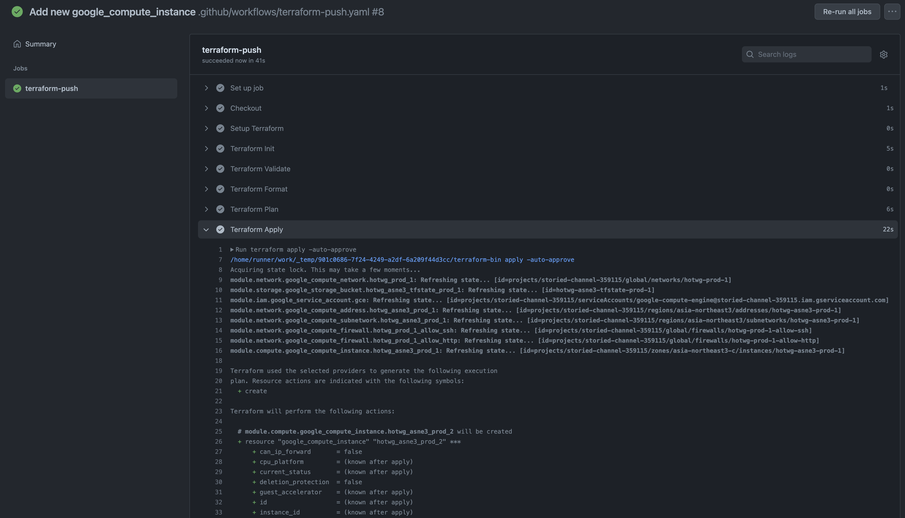
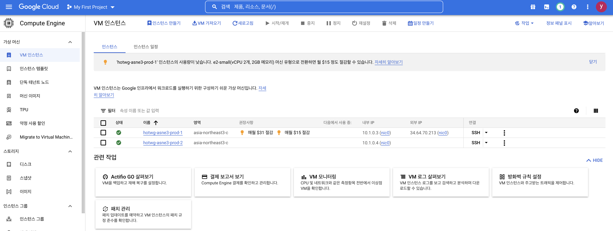

# Push 시 Actions

PR에서 변경사항을 확인하고 리뷰를 거쳐 `main` 브랜치로 머지가 되면 이제 `terraform apply` 가 실행되어야 합니다.
이 작업을 Github Action으로 구현해봅시다.

## yaml 작성하기

프로젝트 최상단에서 다음처럼 `.github/workflows/terraform-push.yaml` 를 만든 뒤, 다음처럼 작성합니다.

```yaml title=".github/workflows/terraform-push.yaml"
on:
  push:
    branches:
      - main

jobs:
  terraform-push:
    runs-on: ubuntu-latest
    defaults:
      run:
        working-directory: ./practice
    steps:
    - name: Checkout
      uses: actions/checkout@v3
      
    - name: Setup Terraform
      uses: hashicorp/setup-terraform@v2
      with:
        terraform_version: 1.2.8

    - name: Terraform Init
      id: init
      run: terraform init
      env:
        GOOGLE_CREDENTIALS: ${{ secrets.GOOGLE_CREDENTIALS }}

    - name: Terraform Validate
      id: validate
      run: terraform validate
      env:
        GOOGLE_CREDENTIALS: ${{ secrets.GOOGLE_CREDENTIALS }}

    - name: Terraform Format
      id: fmt
      run: terraform fmt -check
      env:
        GOOGLE_CREDENTIALS: ${{ secrets.GOOGLE_CREDENTIALS }}

    - name: Terraform Plan
      id: plan
      run: terraform plan -no-color
      env:
        GOOGLE_CREDENTIALS: ${{ secrets.GOOGLE_CREDENTIALS }}
    
    - name: Terraform Apply
      id: apply
      run: terraform apply -auto-approve
      env:
        GOOGLE_CREDENTIALS: ${{ secrets.GOOGLE_CREDENTIALS }}
```

PR을 거치지 않고 바로 `main` 브랜치로 push 되는 경우를 고려하여, `terraform apply` 뿐 아닌 다른 기본적인 작업들도 steps에 포함시켰습니다.

## 결과 확인하기

이제 작성한 Github Action이 잘 작동하는지 확인해봅시다.

먼저 위 변경사항을 다음처럼 커밋하고 푸시합니다.

```bash
$ git add .github/
$ git commit -m "Add github action on push"
$ git push origin main
```

이제 새 브랜치를 만들고, `google_compute_instance` 를 하나 더 추가해봅시다.

```bash
$ git switch -c "test3"
```

```tf title="modules/compute/main.tf"
...

resource "google_compute_instance" "hotwg_asne3_prod_2" {
  name         = "hotwg-asne3-prod-2"
  machine_type = "e2-medium"
  zone         = "asia-northeast3-c"

  boot_disk {
    initialize_params {
      image = "debian-cloud/debian-11"
    }
  }

  network_interface {
    subnetwork = var.subnetwork.id
    # access_config {
    #   nat_ip = var.nat_ip.address
    # }
  }

  service_account {
    email  = var.service_account.email
    scopes = ["cloud-platform"]
  }

  tags = ["allow-http", "allow-ssh"]

  metadata = {
    ssh-keys = "default:ssh-rsa AAAAB3NzaC1yc2EAAAADAQABAAABgQCwdCxPcVEslNkuIA508cd8xRucUIIdKy8PNdHzoFLOzt1HXUtDD6y/pVmqEut4P6DMPPt7WNI8JkqBL7a9FlFIHmLK5hR7aHVKJt7bL/bHacdIH3MagjfwRBmHGY2kTEP+/WSVW6bhqyI5P5dFy22RZt7POqvvzCYnp5rzzl8JBDOjjtLmQz1XwK0Hoa5ue3W1GX8N+TxUo5/psNM4WhHHPZRkRr/lSZqhO4QfwjGK3K88YVyR0kZWWCDsEW/zRZrJgU9/q8oU161Fu/vTZBDw9FoYRfCQ1FfjAw1Wpp1ftXI3hkAyGFf9Ezvfuv5teVO0JnAs5HQ7h8BFw92J45AUSAXcG/yoezqMj/vW3FP08geQhLCZaohc70A5PNkBv90ByACebsOaQ6dbrcdzlZr2KMe2noT9zyr0KMcDmrB7wyUf8jqdRJE7HY4epK+VNwqeZnpvj3n+fHURD2k+Bs8Cpoa6FYfXYW1iRCb+Xe7V7eqHBHTvtGz9o2SfY2a/cC8= user@AL02261967.local"
  }
}
```

??? "전체 코드 보기"

    ```tf title="modules/compute/main.tf"
    resource "google_compute_instance" "hotwg_asne3_prod_1" {
      name         = "hotwg-asne3-prod-1"
      machine_type = "e2-medium"
      zone         = "asia-northeast3-c"

      boot_disk {
        initialize_params {
          image = "debian-cloud/debian-11"
        }
      }

      network_interface {
        subnetwork = var.subnetwork.id
        access_config {
          nat_ip = var.nat_ip.address
        }
      }

      service_account {
        email  = var.service_account.email
        scopes = ["cloud-platform"]
      }

      tags = ["allow-http", "allow-ssh"]

      metadata = {
        ssh-keys = "default:ssh-rsa AAAAB3NzaC1yc2EAAAADAQABAAABgQCwdCxPcVEslNkuIA508cd8xRucUIIdKy8PNdHzoFLOzt1HXUtDD6y/pVmqEut4P6DMPPt7WNI8JkqBL7a9FlFIHmLK5hR7aHVKJt7bL/bHacdIH3MagjfwRBmHGY2kTEP+/WSVW6bhqyI5P5dFy22RZt7POqvvzCYnp5rzzl8JBDOjjtLmQz1XwK0Hoa5ue3W1GX8N+TxUo5/psNM4WhHHPZRkRr/lSZqhO4QfwjGK3K88YVyR0kZWWCDsEW/zRZrJgU9/q8oU161Fu/vTZBDw9FoYRfCQ1FfjAw1Wpp1ftXI3hkAyGFf9Ezvfuv5teVO0JnAs5HQ7h8BFw92J45AUSAXcG/yoezqMj/vW3FP08geQhLCZaohc70A5PNkBv90ByACebsOaQ6dbrcdzlZr2KMe2noT9zyr0KMcDmrB7wyUf8jqdRJE7HY4epK+VNwqeZnpvj3n+fHURD2k+Bs8Cpoa6FYfXYW1iRCb+Xe7V7eqHBHTvtGz9o2SfY2a/cC8= user@AL02261967.local"
      }
    }

    resource "google_compute_instance" "hotwg_asne3_prod_2" {
      name         = "hotwg-asne3-prod-2"
      machine_type = "e2-medium"
      zone         = "asia-northeast3-c"

      boot_disk {
        initialize_params {
          image = "debian-cloud/debian-11"
        }
      }

      network_interface {
        subnetwork = var.subnetwork.id
        # access_config {
        #   nat_ip = var.nat_ip.address
        # }
      }

      service_account {
        email  = var.service_account.email
        scopes = ["cloud-platform"]
      }

      tags = ["allow-http", "allow-ssh"]

      metadata = {
        ssh-keys = "default:ssh-rsa AAAAB3NzaC1yc2EAAAADAQABAAABgQCwdCxPcVEslNkuIA508cd8xRucUIIdKy8PNdHzoFLOzt1HXUtDD6y/pVmqEut4P6DMPPt7WNI8JkqBL7a9FlFIHmLK5hR7aHVKJt7bL/bHacdIH3MagjfwRBmHGY2kTEP+/WSVW6bhqyI5P5dFy22RZt7POqvvzCYnp5rzzl8JBDOjjtLmQz1XwK0Hoa5ue3W1GX8N+TxUo5/psNM4WhHHPZRkRr/lSZqhO4QfwjGK3K88YVyR0kZWWCDsEW/zRZrJgU9/q8oU161Fu/vTZBDw9FoYRfCQ1FfjAw1Wpp1ftXI3hkAyGFf9Ezvfuv5teVO0JnAs5HQ7h8BFw92J45AUSAXcG/yoezqMj/vW3FP08geQhLCZaohc70A5PNkBv90ByACebsOaQ6dbrcdzlZr2KMe2noT9zyr0KMcDmrB7wyUf8jqdRJE7HY4epK+VNwqeZnpvj3n+fHURD2k+Bs8Cpoa6FYfXYW1iRCb+Xe7V7eqHBHTvtGz9o2SfY2a/cC8= user@AL02261967.local"
      }
    }
    ```

이제 변경사항을 커밋하고, 새 브랜치로 푸시합니다.

```bash
$ git commit -m "Add new google_compute_instance"
$ git push origin test3
```

이제 PR을 생성한 후, `main` 브랜치에 머지하면 다음처럼 Action이 성공하고, 리소스가 잘 추가된 것을 확인할 수 있습니다.





