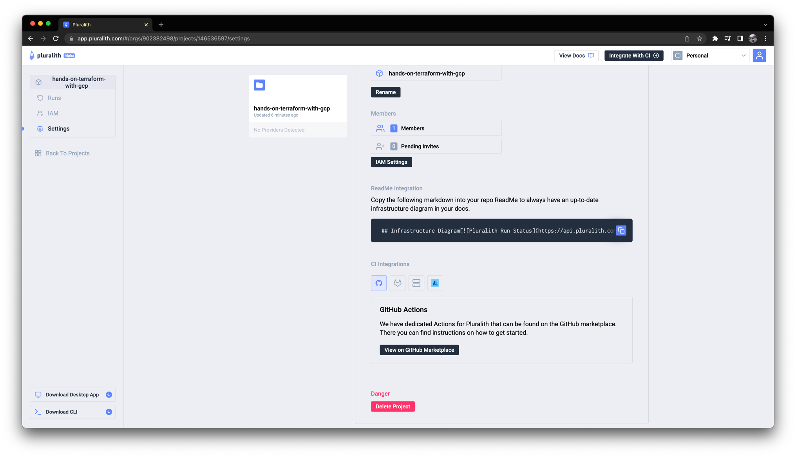
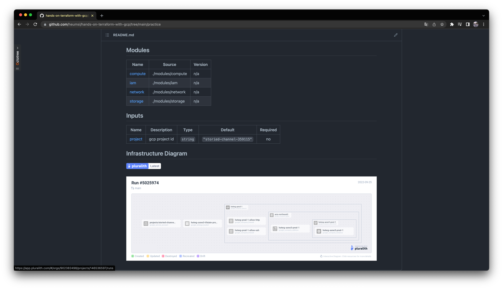

# 현재 리소스 시각화하기

Terraform 리소스를 적용한 이후, 만들어진 리소스를 시각화한 뒤 이를 `README.md` 에 자동으로 반영하는 작업을 해봅시다.

!!! Info

    이 작업은 [변경되는 리소스 시각화하기](../03-actions-if-pr/03-visualize-modified-resources.md)의 내용이 선행되었음을 가정하고 진행합니다.

## yaml 작성하기

`.github/workflows/terraform-push.yaml` 에 다음 내용을 추가합니다.

```yaml title=".github/workflows/terraform-push.yaml"
jobs:
  ...
  pluralith:
    needs: terraform-push
    runs-on: ubuntu-latest
    env:
      working-directory: ./practice
    steps:
      - name: Check out repository
        uses: actions/checkout@v3
        with:
          ref: ${{ github.event.pull_request.head.ref }}

      # Set up Terraform
      - name: Setup Terraform
        uses: hashicorp/setup-terraform@v1
        with:
          terraform_wrapper: false # This is recommended so the `terraform show` command outputs valid JSON
        env:
          GOOGLE_CREDENTIALS: ${{ secrets.GOOGLE_CREDENTIALS }}

      # Init Terraform project
      - name: Terraform Init
        run: terraform init
        working-directory: ${{ env.working-directory }}
        env:
          GOOGLE_CREDENTIALS: ${{ secrets.GOOGLE_CREDENTIALS }}

      - name: Setup Infracost
        uses: infracost/actions/setup@v2
        # See https://github.com/infracost/actions/tree/master/setup for other inputs
        # If you can't use this action, see Docker images in https://infracost.io/cicd
        with:
          api-key: ${{ secrets.INFRACOST_API_KEY }}

      # Set up and authenticate Pluralith
      - name: Pluralith Init
        uses: Pluralith/actions/init@v1.1.0
        with:
          terraform-path: ${{ env.working-directory }}
          api-key: ${{ secrets.PLURALITH_API_KEY }}
          project-id: ${{ secrets.PLURALITH_PROJECT_ID }}
        env:
          GOOGLE_CREDENTIALS: ${{ secrets.GOOGLE_CREDENTIALS }}

      # Run Pluralith to generate an infrastructure diagram and comment body
      - name: Pluralith Run
        uses: Pluralith/actions/run@v1.1.0
        with:
          terraform-path: ${{ env.working-directory }}
          show-changes: true
          show-drift: true
          show-costs: true # Requires Infracost to be set up in your pipeline
        env:
          GOOGLE_CREDENTIALS: ${{ secrets.GOOGLE_CREDENTIALS }}
```

??? "전체 코드 보기"

    ```yaml title=".github/workflows/terraform-push.yaml"
    on:
      push:
        branches:
          - main
    
    jobs:
      terraform-push:
        runs-on: ubuntu-latest
        defaults:
          run:
            working-directory: ./practice
        steps:
        - name: Checkout
          uses: actions/checkout@v3
          
        - name: Setup Terraform
          uses: hashicorp/setup-terraform@v2
          with:
            terraform_version: 1.2.8
    
        - name: Terraform Init
          id: init
          run: terraform init
          env:
            GOOGLE_CREDENTIALS: ${{ secrets.GOOGLE_CREDENTIALS }}
    
        - name: Terraform Validate
          id: validate
          run: terraform validate
          env:
            GOOGLE_CREDENTIALS: ${{ secrets.GOOGLE_CREDENTIALS }}
    
        - name: Terraform Format
          id: fmt
          run: terraform fmt -check
          env:
            GOOGLE_CREDENTIALS: ${{ secrets.GOOGLE_CREDENTIALS }}
    
        - name: Terraform Plan
          id: plan
          run: terraform plan -no-color
          env:
            GOOGLE_CREDENTIALS: ${{ secrets.GOOGLE_CREDENTIALS }}
        
        - name: Terraform Apply
          id: apply
          run: terraform apply -auto-approve
          env:
            GOOGLE_CREDENTIALS: ${{ secrets.GOOGLE_CREDENTIALS }}
    
      pluralith:
        needs: terraform-push
        runs-on: ubuntu-latest
        env:
          working-directory: ./practice
        steps:
          - name: Check out repository
            uses: actions/checkout@v3
            with:
              ref: ${{ github.event.pull_request.head.ref }}
    
          # Set up Terraform
          - name: Setup Terraform
            uses: hashicorp/setup-terraform@v1
            with:
              terraform_wrapper: false # This is recommended so the `terraform show` command outputs valid JSON
            env:
              GOOGLE_CREDENTIALS: ${{ secrets.GOOGLE_CREDENTIALS }}
    
          # Init Terraform project
          - name: Terraform Init
            run: terraform init
            working-directory: ${{ env.working-directory }}
            env:
              GOOGLE_CREDENTIALS: ${{ secrets.GOOGLE_CREDENTIALS }}
    
          - name: Setup Infracost
            uses: infracost/actions/setup@v2
            # See https://github.com/infracost/actions/tree/master/setup for other inputs
            # If you can't use this action, see Docker images in https://infracost.io/cicd
            with:
              api-key: ${{ secrets.INFRACOST_API_KEY }}
    
          # Set up and authenticate Pluralith
          - name: Pluralith Init
            uses: Pluralith/actions/init@v1.1.0
            with:
              terraform-path: ${{ env.working-directory }}
              api-key: ${{ secrets.PLURALITH_API_KEY }}
              project-id: ${{ secrets.PLURALITH_PROJECT_ID }}
            env:
              GOOGLE_CREDENTIALS: ${{ secrets.GOOGLE_CREDENTIALS }}
    
          # Run Pluralith to generate an infrastructure diagram and comment body
          - name: Pluralith Run
            uses: Pluralith/actions/run@v1.1.0
            with:
              terraform-path: ${{ env.working-directory }}
              show-changes: true
              show-drift: true
              show-costs: true # Requires Infracost to be set up in your pipeline
            env:
              GOOGLE_CREDENTIALS: ${{ secrets.GOOGLE_CREDENTIALS }}
    ```

조금 더 설명을 덧붙이면

- `main` 브랜치에 push 시 Pluralith에 업데이트된 Terraform 리소스를 시각화하는 작업을 진행합니다.
- 추가한 job은 직전 job인 `terraform-push` 이 끝난 이후에 실행됩니다.
- 전반적으로 steps는 [변경되는 리소스 시각화하기](../03-actions-if-pr/03-visualize-modified-resources.md)와 거의 비슷합니다.

## `README.md` 수정하기

Pluralith 웹 대시보드에서 다음처럼 `ReadMe Integration` 항목이 소개되어 있습니다.



이 부분을 복사하여 다음처럼 프로젝트 최상단에 있는 `README.md` 에 추가합니다.

```md title="README.md"
## Infrastructure Diagram

[](https://pluralith.com)<br></br>[](https://app.pluralith.com/#/orgs/902382498/projects/146536597/runs)
```

??? "전체 코드 보기"

    ```md title="README.md"
    <!-- BEGIN_TF_DOCS -->
    ## Requirements
    
    | Name | Version |
    |------|---------|
    | <a name="requirement_google"></a> [google](#requirement\_google) | 4.33.0 |
    
    ## Modules
    
    | Name | Source | Version |
    |------|--------|---------|
    | <a name="module_compute"></a> [compute](#module\_compute) | ./modules/compute | n/a |
    | <a name="module_iam"></a> [iam](#module\_iam) | ./modules/iam | n/a |
    | <a name="module_network"></a> [network](#module\_network) | ./modules/network | n/a |
    | <a name="module_storage"></a> [storage](#module\_storage) | ./modules/storage | n/a |
    
    ## Inputs
    
    | Name | Description | Type | Default | Required |
    |------|-------------|------|---------|:--------:|
    | <a name="input_project"></a> [project](#input\_project) | gcp project id | `string` | `"storied-channel-359115"` | no |
    <!-- END_TF_DOCS -->
    
    ## Infrastructure Diagram
    
    [](https://pluralith.com)<br></br>[](https://app.pluralith.com/#/orgs/902382498/projects/146536597/runs)
    ```

이제 `README.md` 에는 Pluralith의 최신 리소스 현황을 시각화한 내용을 담게 됩니다.

## 결과 확인하기

이제 작성한 Github Action이 잘 작동하는지 확인해봅시다.

먼저 위 변경사항을 다음처럼 커밋하고 푸시합니다.

```bash
$ git add .github/
$ git add README.md
$ git commit -m "Add resource visualization to README.md"
$ git push origin main
```

Action이 성공하고나면 다음처럼 `README.md` 에서 시각화된 현재 리소스를 확인할 수 있습니다.


